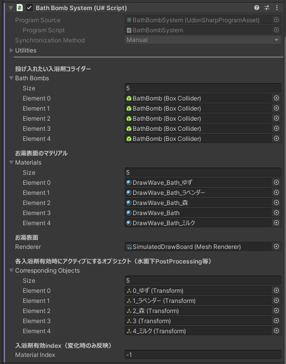

# YUTOROOM Essentials

日本の風呂ワールドに不可欠なギミック群

## インストール

### VCCによる方法

1. https://vpm.narazaka.net/ から「Add to VCC」ボタンを押してリポジトリをVCCにインストールします。
2. VCCでSettings→Packages→Installed Repositoriesの一覧中で「Narazaka VPM Listing」にチェックが付いていることを確認します。
3. アバタープロジェクトの「Manage Project」から「YUTOROOM Essentials」をインストールします。

## 使い方

### BathBombSystem

入浴剤によるお湯の色変化

- VRCPickup+ObjectSyncで投げられる入浴剤コライダーと、同数のマテリアル、アクティブオブジェクトを指定します。
- アクティブオブジェクトには水面下PostProcessing Volumeなどを指定します。

## DrinkSound

### セットアップ

1. VRCPickupのついた飲み物オブジェクトに`DrinkSoundPickup`を付けます。
2. その飲み物オブジェクトの子に`DrinkSound` prefabを配置します。
3. それぞれを参照させます。
4. `DrinkSound`のAudioSourceに飲む音を設定します。（飲む音を設定したprefab variantを作ると便利だと思います。）
  - YUTOROOMの飲む音はこちらを使用しました。  [ごくごく飲む（ニコニ・コモンズ）](https://commons.nicovideo.jp/works/nc44239)

### 既知の問題

- 同期されて聞こえるようにしようかと思ったがやめた。
  - その名残でDrinkSoundPickupがManual Syncになっているため、飲み物オブジェクトには[ManualObjectSync](https://github.com/mimyquality/FukuroUdon/wiki/Manual-ObjectSync)を付けることを推奨します。

## 更新履歴

- 1.0.0
  - リリース

## License

[Zlib License](LICENSE.txt)
