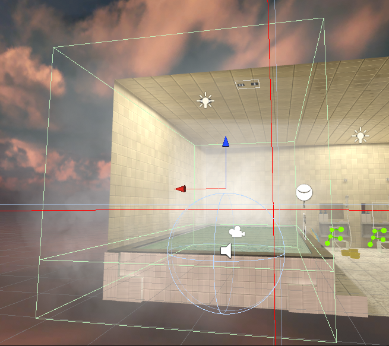
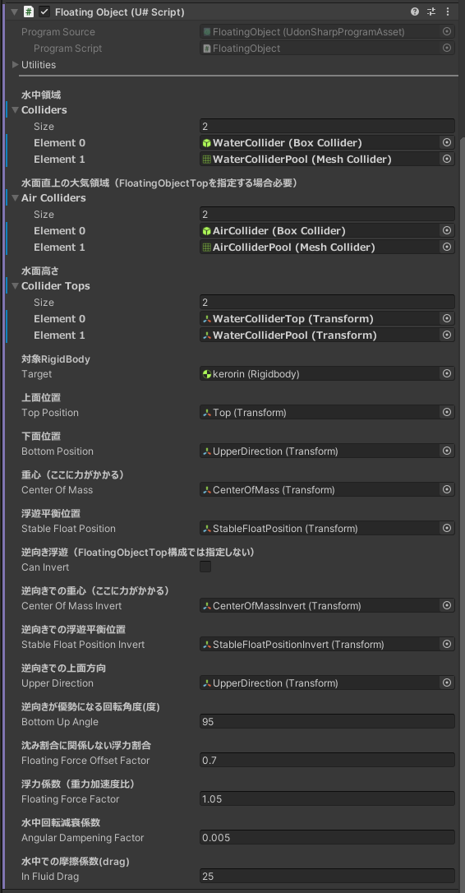
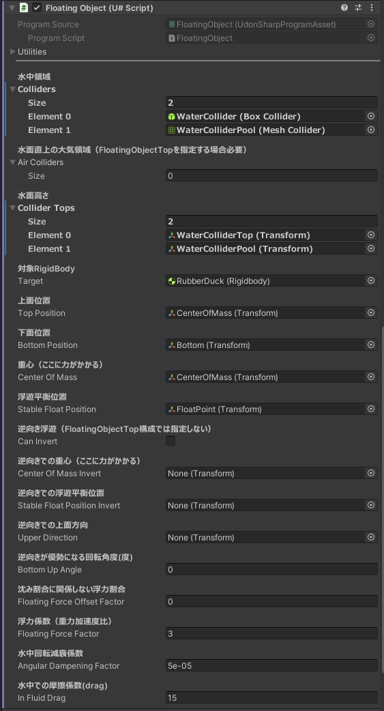
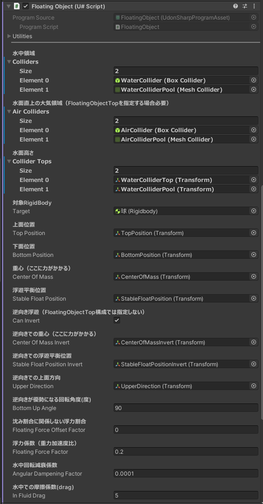
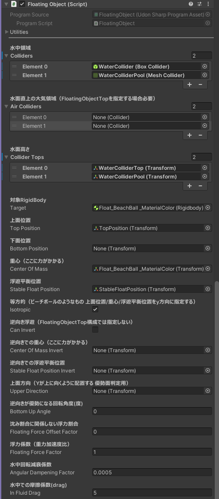
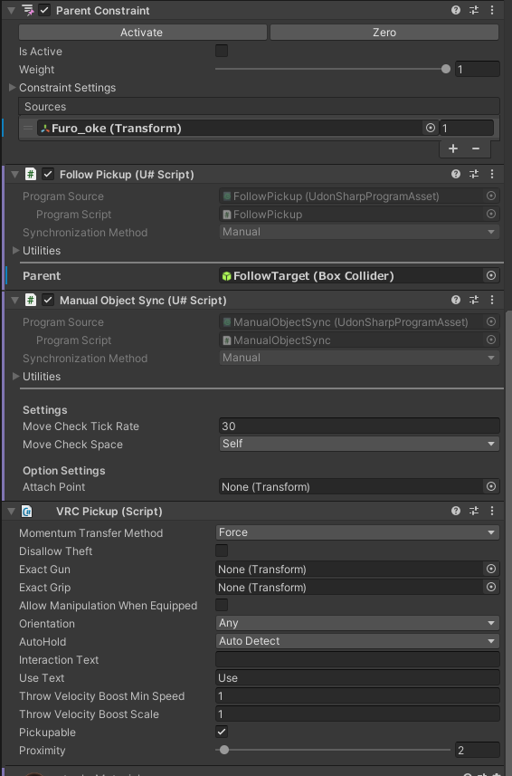
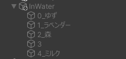
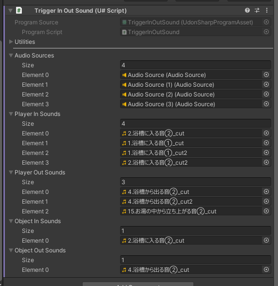

# YUTOROOM Essentials

日本の風呂ワールドに不可欠なギミック群

## インストール

### VCCによる方法

1. https://vpm.narazaka.net/ から「Add to VCC」ボタンを押してリポジトリをVCCにインストールします。
2. VCCでSettings→Packages→Installed Repositoriesの一覧中で「Narazaka VPM Listing」にチェックが付いていることを確認します。
3. アバタープロジェクトの「Manage Project」から「YUTOROOM Essentials」をインストールします。

## 使い方

### BathBombSystem

入浴剤によるお湯の色変化

- VRCPickup+ObjectSyncで投げられる入浴剤コライダーと、同数のマテリアル、アクティブオブジェクトを指定します。
- アクティブオブジェクトには水面下PostProcessing Volumeなどを指定します。

### DrinkSound

ドリンクを飲む音

#### セットアップ

1. VRCPickupのついた飲み物オブジェクトに`DrinkSoundPickup`を付けます。
2. その飲み物オブジェクトの子に`DrinkSound` prefabを配置します。
3. それぞれを参照させます。
4. `DrinkSound`のAudioSourceに飲む音を設定します。（飲む音を設定したprefab variantを作ると便利だと思います。）
  - YUTOROOMの飲む音はこちらを使用しました。  [ごくごく飲む（ニコニ・コモンズ）](https://commons.nicovideo.jp/works/nc44239)

#### 既知の問題

- 同期されて聞こえるようにしようかと思ったがやめた。
  - その名残でDrinkSoundPickupがManual Syncになっているため、飲み物オブジェクトには[ManualObjectSync](https://github.com/mimyquality/FukuroUdon/wiki/Manual-ObjectSync)を付けることを推奨します。

### FloatingObject

風呂の水面に浮くオブジェクト

- [風呂桶](https://misagon339.booth.pm/items/2002692)のような凹面があり空気が入るオブジェクト
- [アヒルのおもちゃ（ラバーダック）](https://okpshop.booth.pm/items/2214230)のような上面が決定しているオブジェクト
- [浮き輪](https://tinmeshi.booth.pm/items/4938288)のような上下面が反転可能なオブジェクト

などを自然に浮かせる事が出来ます。

上手い具合に数値調整などをする必要があり設定はそれなりに煩雑です。

#### (共通) 水の領域コライダーを設定する

- 水の領域コライダー`WaterCollider`
- 水面高さTransform`WaterColliderTop`
- 水面直上の大気領域コライダー`AirCollider`

を設定します。

#### 風呂桶（凹面があり空気が入るオブジェクト）のセットアップ

サンプルは`Samples/FloatingObject/風呂桶sample.prefab`にあります。

VRCPickupのついた風呂桶オブジェクトの下に以下を設定します。

- 開口部を覆うコライダーを作り、`FloatingObjectTop`コンポーネントを追加します。
  - 下記の`FloatingObject`コンポーネントを参照させます。
- オブジェクトの形状に沿ったコライダーを作り、`FloatingObject`コンポーネントを追加します。
- サンプルを参考に各種設定を行ってください。
  - CanInvertはfalse

#### アヒルのおもちゃ（上面が決定しているオブジェクト）

サンプルは`Samples/FloatingObject/ラバーダックsample.prefab`にあります。

- オブジェクトの形状に沿ったコライダーを作り、`FloatingObject`コンポーネントを追加します。
- サンプルを参考に各種設定を行ってください。

#### 浮き輪（上下面が反転可能なオブジェクト）

サンプルは`Samples/FloatingObject/裏表sample.prefab`にあります。

- オブジェクトの形状に沿ったコライダーを作り、`FloatingObject`コンポーネントを追加します。
- サンプルを参考に各種設定を行ってください。

#### ビーチボール（等方的なオブジェクト）

サンプルは`Samples/FloatingObject/ビーチボールsample.prefab`にあります。

- オブジェクトの形状に沿ったコライダーを作り、`FloatingObject`コンポーネントを追加します。
- サンプルを参考に各種設定を行ってください。
  - Isotropic=true
  - TopPosition/CenterOfMass/StableFloatPositionについてローカルY座標を中心からの径として設定します

#### Tips

上下位置が安定した後左右に振動する場合はAngularDampeningFactorの桁を小さくしてみて下さい。

### FollowPickup

親に追従するPickupオブジェクト

- 親のコライダー内にDropされたオブジェクトは以後親に追従するようになります
- 親のコライダー外にDropされたオブジェクトは以後親に追従しなくなります

風呂桶に酒瓶を置くなどに利用できます。
Drop時に子の位置や向きの補正等は行わないので「トレーに載せる」要件などでは不自然になります。

#### セットアップ

- 子となるPickupオブジェクトにParentConstraintを追加し、親オブジェクトをSourcesに指定します。Activeにはしません。
- 同オブジェクトに`FollowPickup`コンポーネントを追加し、Parentに親オブジェクトの追従領域コライダーを指定します。
- 子オブジェクトは親オブジェクトの外に置きます（ヒエラルキー上の親子関係にはしない）

### InWater

水中に潜る時の効果

潜る時の音や視界効果を設定するのに適しています。

#### セットアップ

- `InWater` prefabを配置し、水中コライダーの位置を合わせます。
- 音系とAudioLowPassFilterを指定します。
  - [VRChatワールドではAudioListenerをシーン上に置いておくとプレイヤーのAudioListenerを上書きします。](https://vrcworld.wiki.fc2.com/wiki/Audio)これを利用してAudioLowPassFilterを指定できます。
    - AudioSourceのサンプルが`Samples/AudioSource.prefab`にあるのでシーンに配置し参照して下さい。
  - YUTOROOMでの音は以下の通りです
    - 水中音（StaySound）: [水中泳ぐ・潜水 by On-Jin ～音人～](https://on-jin.com/sound/listshow.php?pagename=spo&title=%E6%B0%B4%E4%B8%AD%E6%B3%B3%E3%81%90%E3%83%BB%E6%BD%9C%E6%B0%B4&janl=%E9%81%8B%E5%8B%95%E3%83%BB%E9%81%8A%E6%88%AF%E7%B3%BB%E9%9F%B3&bunr=%E6%B3%B3%E3%81%90&kate=%E3%82%B9%E3%83%9D%E3%83%BC%E3%83%84)
    - 出入りの音: [【効果音】風呂/オコジョ彗星](https://www.dlsite.com/home/work/=/product_id/RJ293180.html) をカット編集したもの
- 水中のPostProcessing Volumeを制御する場合、入れ子構造にして親を操作すると`BathBombSystem`と連携できます。

### ToggleReverbByActive

オブジェクトのON/OFFに連動してAudioReverbFilterをON/OFFします

#### セットアップ

- オブジェクトに`ToggleReverbByActive`を付けて、AudioReverbFilterを指定します。
- このオブジェクトをコライダー判定などでactive/inactiveにするとAudioReverbFilterが連動します。
  - AudioSourceのサンプルが`Samples/AudioSource.prefab`にあるのでシーンに配置し参照して下さい。

### TriggerInOutSound

コライダーにプレイヤーやPickupオブジェクトが出たり入ったりする時に音を出します

#### セットアップ

- 水中コライダーに`TriggerInOutSound`コンポーネントを付けます。
- AudioSourcesに音を再生するAudioSourceを何個か設定します。
  - 発声上限に引っかからないようオブジェクトプール的に使いまわします。
- 各種の音を設定します。

## Tips

YUTOROOMで利用している他のシステムとしては以下などがあります。

（というかむしろ、これらの高い没入感を醸成する重要な要素技術が既にあるにも関わらず風呂ワールドで活用されていないことに歯がゆさを覚えてYUTOROOMが作られたという面が大きいです。これらに加えて付随する風呂体験を作り込んでさらに質を高めようとした周辺技術が本ライブラリの内容なので、とりあえず風呂ワールドを作ろうという場合にはまずは下記の適用を先に行う方が効果的だと思います。）

- お風呂水面の波紋: [InteractiveWater (VRC向け触れる水)](https://booth.pm/ja/items/1502201)
- お風呂の水しぶき: [ばしゃばしゃ水遊びシステム【VRChatワールド用】](https://booth.pm/ja/items/3929644)
  - 足でも反応する＆音が出るように改変しています

## 更新履歴

- 1.0.0
  - リリース

## License

[Zlib License](LICENSE.txt)
